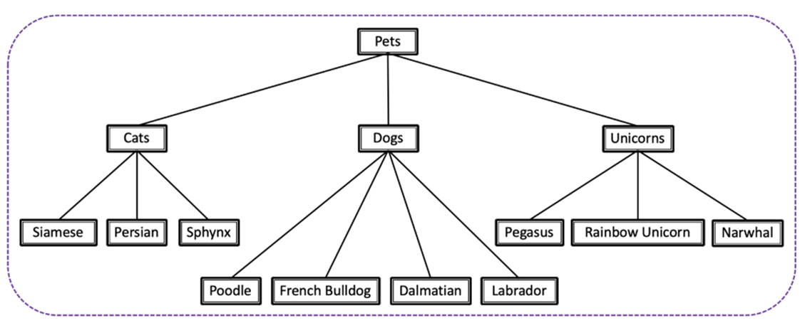
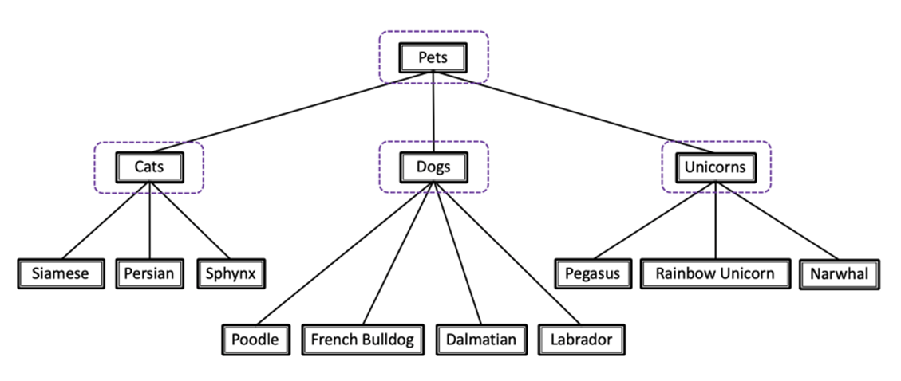
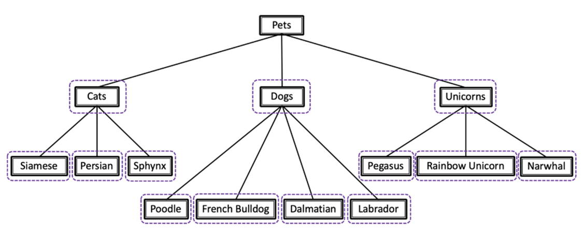
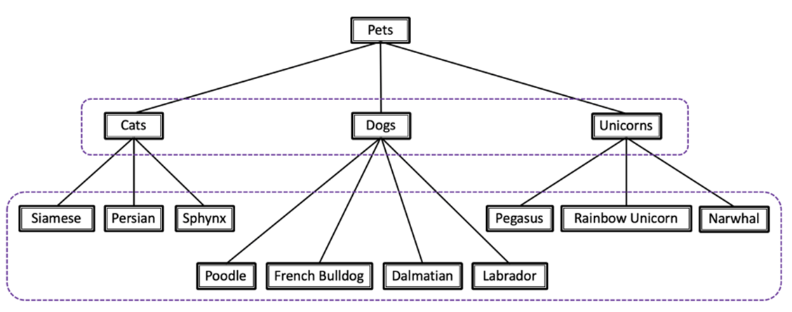
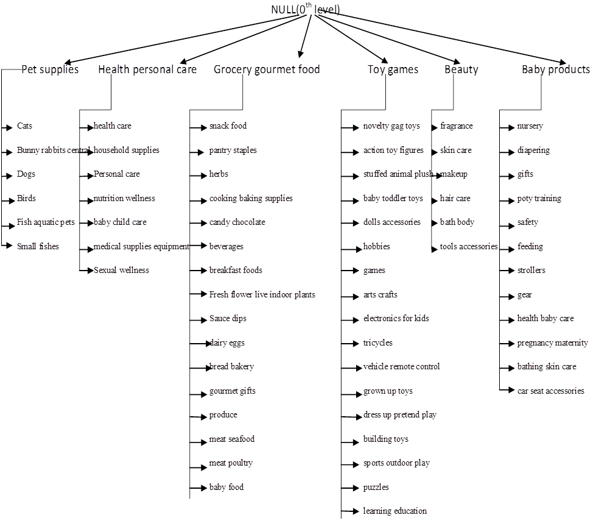

# **Hierarchical classifier for text classification using(BertforSequenceClassification):-**

**Introduction:-** The given problem statement required a methodology for classification of texts on three levels (primary:- _'Cat1'_, secondary:-_'Cat2'_, tertiary:- _'Cat3'_).

Generally on a broader scale, there are two types of classifier that prevail in the case of hierarchical classifications:-

#### (1.) <u>**Global classifiers**</u>:- 
These are single classifiers that are trained for prediction of all hierarchical classes. Its generally tried to maintain the order of hierarchy while doing the classification, but its quite tricky to control the same. Hence the architecture of these classifiers are very complex at times even and so they are not quite popular even though they require less memory.

#### (2.) <u>**Local classifiers**</u>:- 
They are basically of three types:-

(a.) **Local classifier per parent node (LCPN)**: training one **multi-class** classifier for each **parent node**, to distinguish between its child nodes.  
   In the below example, that would mean one classifier on the first level (to determine "cat", "dog" or "unicorn"), then three more classifiers to determine the specific breed.

(b.) **Local classifier per node (LCN)**: training one **binary** classifier for each **node** in the hierarchy ("Pets" node excluded).  
   Is this a cat? Is this a French bulldog? Is this a rainbow unicorn? Each question gets a classifier.

(c.) **Local classifier per level (LCL):** training one **multi-class** classifier for each **level**.  
   In the below example, that would mean two classifiers: one to determine race (cat, dog, or fabulous unicorn), and the other for breed (Persian cat, Labrador, Narwhal, etc.).  
   This approach has some inconsistency problem, for instance: getting "dog" for race and "Pegasus" for breed is a very possible outcome. In order to avoid it, we need to use some heuristics at times.

All of these local classifiers do require quite a lot memory, with **LCN > LCPN >LCL** order in terms of memory consumption.

**Flow for the given problem:-**

Due to lack of space, I have not been able to inculcate the 3rd level (tertiary classes). But they are 377 as a whole in count.

So basically, I have used:-

- **1 LCPN model at level 0**(parent being NULL for prediction of primary classes:- _Pet supplies, Health personal care, Grocery gourmet foods, Toy games, Beauty, Baby products_).
- **6 LCPN** **models at level 1**(parents for each being the primary classes mentioned above point). All the six models are multiclass models that have respective secondary level classes for each primary level parent:-
   - _Pet supplies parent classifier:- 6 classes (mentioned in above chart)_
   - _Health personal care classifier :- 7 classes (mentioned in above chart)_
   - _Grocery gourmet foods classifier:- 16 classes (mentioned in above chart)_
   - _Toy games classifier:- 17 classes (mentioned in above chart)_
   - _Beauty classifier:- 6 classes (mentioned in above chart)_
   - _Beauty products:- 12 classes (mentioned in above chart)_
- **1 LCL (for prediction of tertiary classes, total 377 in number few of which might get repeated under multiple secondary classes).** I have called it level2 classifier just to maintain the above convention (though its not a LCPN model at secondary parent classes). Ideally it would have have been preferable to have 64 different LCPN models at level 2, but since they would have been consumed tremendous memory, I proceeded with single LCL classifier. In order to maintain the **primary 🡪secondary 🡪 tertiary** hierarchy that a typical LCL does lack, I have used few heuristics (I'll explain about them in below sections).

## (A.) **0th level classifier:-**

### **Training:-**

- It's a **_LCPN classifier at 0th level parent :- NULL_**.
- The total number of primary level predicted classes (_'Cat1_predicted'_) from this model is 6 (_Pet supplies, Health personal care, Grocery gourmet foods, Toy games, Beauty, Baby products_).
- For training data, the elements in the **_'title'_** and **_'text'_** column have been concatenated with '. ' delimiter for each record, so as to generate the training input. For training output corresponding _'Cat1'_ labels have been considered. So, in total there are 10000 training samples.
- For model training, I have used BERT model of **_'bert-base-uncased'_** and fine tuned it for the given samples.
- Training has been done on 70-30 train-validation split, and the **_best_f1_score and accuracy for validation set are 0.931602139 and 0.93 respectively on validation set_**.

### **Testing :-**

- For testing, the complete data has been considered. Test data have been again created in the manner as in training. And the **_overall f1_score and accuracy for prediction are 0.977551587 and 0.98 during testing._**

## (B.) **1st level classifiers:-**

### **Training:-**

- They are group **_of 6 LCPN classifiers each centered at the first level parent classes (Pet supplies, Health personal care, Grocery gourmet foods, Toy games, Beauty, Baby products)_**.
- The total number of secondary level predicted classes (_'Cat2_predicted'_) from these models for each primary parent class have been mentioned in earlier section.
- For training, data the elements in the **_'title'_** have been concatenated with each sentence granules of **_'text'_** (tokenized by nltk) one by one to form multiple train inputs for a combination of '_title'_ and _'text'_ present in each row. Correspondingly the train outputs have been generated from _'Cat2'_ labels for each train input. For each record in original data sheet, hash has been formed based on _'product', 'userId' and 'Time'_ field and this hash repeats itself (in new dataframe consisting train inputs and outputs along with hash) for the combination of title and text granules of a particular row in original data.
- The idea to have train inputs as combinations of _'title'_ and _'text'_ granules is to increase the support for each secondary class and in someway also to reduce the length of train input phrase for efficient classification.
- For model training, again I have used BERT model of **_'bert-base-uncased'_** and fine tuned it for the given samples.
- Training has been done on 80-20 train-validation split and following are the metrics for each model on validation set:-

|     | **1st level clqssifiers**   |                    |                 |        |                                          |         |
| --- | --------------------------- | ------------------ | --------------- | ------ | ---------------------------------------- | ------- |
|     | _Parent_node_               | _best_weighted_f1_ | _best_accuracy_ | _loss_ | _support_                                | _split_ |
|     | pet supplies                | 0.986022812        | 0.99            | 0.02   | 7125( granulated from 1576)              | 80-20   |
|     |                             |                    |                 |        |                                          |
|     | health personal care        | 0.991886679        | 0.99            | 0.03   | 11820 (granulated from 2992)             | 80-20   |
|     | grocery gourmet  food | 0.959521823        | 0.96            | 0.33   | 3413 (granulated from original 850 odds) | 80-20   |
|     | toys games                  | 0.970342152        | 0.97            | 0.06   | 6708 (granular:- 1759)                   | 80-20   |
|     |                             |                    |                 |        |                                          |
|     | beauty                      | 0.991974574        | 0.99            | 0.08   | 8499 (granulated from 2135)              | 80-20   |
|     | baby_products               | 0.992740047        | 0.99            | 0.28   | 3046 (granuled from 628 odds)            | 80-20   |

### **Testing:-**

- For testing, the complete data has been considered. Again the granules and repetitive hashes were created for _'title'_ and _'text'_ field of each original record as mentioned in the training part. The predictions for each granule were done and the **_mode of those predictions_** was chosen for the corresponding record in the original data.
- Test metrics on each of 6 1st level LCPN trained models are:-

|     | **1st level calssifiers**   |                    |                 |           |
| --- | --------------------------- | ------------------ | --------------- | --------- |
|     | _Parent_node_               | _best_weighted_f1_ | _best_accuracy_ | _support_ |
|     | pet supplies                | 0.975554195        | 0.98            | 1570      |
|     |                             |                    |                 |
|     | health personal care        | 0.949561057        | 0.965           | 3013      |
|     | grocery gourmet  food | 0.939769406        | 0.94            | 833       |
|     | toys games                  | 0.967674911        | 0.97            | 1745      |
|     |                             |                    |                 |
|     | beauty                      | 0.962035057        | 0.97            | 2122      |
|     | baby_products               | 0.921894914        | 0.94            | 717       |

## (C.) **2nd level classifier:-**

### **Training:-**

- It's a **LCL classifier for prediction of 377 tertiary classes _(cat3_perdicted)_**_._
- As in case of level one classifiers, training data volume has been increased by concatenating 'title' field and granules of the 'text' field by ', ' delimiter one by one. _But for the granules whose 'Cat3' classes are quite few(less than 20 in original data) in support, the newly granulated train_inputs and train_outputs of those cases have been repeteadly upsampled a bit(uptill 20 and not to frequency of major 'Cat3 class'), just to increase the support of those classes._
- The rest of the procedure is same as that for each of the1st level classifiers, with the alteration of train-validation split being 90-10 this time.
- The **_best_f1_score and accuracy for validation set are 0.967553195 and 0.9676 respectively on validation set_**.

### **Testing:-**

- Since the classifier is LCL type, care was taken to maintain the hierarchy of primary class (Cat1_predicted) 🡪secondary class (Cat2_predicted) 🡪Tertiary class(Cat3_predicted). To do so, a nested mapping containing primary class, secondary class and tertiary class was created(namely:- **_di_prim_sec_**) where _each Cat1 label has set of Cat2 labels, and each Cat2 label has a set of Cat3 labels_.
- Once the test data was created from complete data in a manner as mentioned in the training step, **the _logits array_** _for each granular data inputs of particular record in original data were stored. Now for that particular record in the original data, the_ **_possible set of tertiary classes_** _were derived from the nested mapping mentioned in above point taking for the given_ **_Cat1_prediction_** _and_ **_Cat2_prediction_** _for the same record. Thereafter the logits array list were averaged to get one final logits array for the given record (in original data)._ **_And a class priority list was prepared in most prior to least manner based on score of final logits array._**
- _Finally the elements of class priority list were iterated from 0th index,_ **_and the first class which was found in possible set of tertiary classes (mentioned in the previous point), was accepeted as the 'Cat3_prediction'_** _for the given record in original data and likewise the index of that class was also appended under '_**_Cat3_class_priority_index'_** _column._
- **_The overall f1_score and accuracy for overall predictions are 0.968791128 and 0.9689 during testing._**

### _The accuracy of all the three predictions namely (Cat1_prediction, Cat2_prediction and Cat3_prediction) being correct simultaneously for records of complete data (10000 rows) is_ **0.965**.

\---------------------------------------------------------------------------------------------------------------------------------------------

### (D.)**Note:-** 
The trained file is **_"heirarchical_classifier_train_new.ipynb"_** and test file is **_"heirarchical_classifier_inference.ipynb"._** The input file is given as **_data.csv_** which is to be used at time of training.

### (E.)**Appendix:-**

- Since we use **_BertForSequenceClassification_**, the train and test code flow can be referred form **_NLP-text_classification project_**(path :- _NLP-text_classification/Readme.md_).--> Similar to there **_preprocessing class_** is defined here that **_handles tokenization, normalization via padding, input_ids and attention_masks generation_**. Then likewise **_data is split, Dataloaders(train/val)_** with batch size are called, **_train hyperparameters_** defined, _metrics(defined by fn or imported)_ and **_training model_** **_epoch_** loop ran over. Analysis of **_relevant metrics analysis over validation set_** is done simultaneously across **_epochs(best version saved)_**. Also **_plot of train vs validation loss_** across epochs is done.

- #### **Nuancial differences**:-

   1.) During preprocessing _0th (primary), 1st (secondary )and 2nd (tertiary) levels_ are handled bit differently. The _previous same analogy followed when saving models at these levels_. 1stly a _weight dictionary_**_(weight_dict)_** is defined for all models at each level where labels of **_Cat1, Cat2, Cat3_** are keys with their corresponding weights as values.

   - **Since 1 LCPN classifier at 0th level**, normal label_count for Cat1 is done for 0th level calculate inversely proportional weights for each levels(during preprocess). Also model and weight_dict saving done at _:-" MyDrive/heirarchical_classifier_level_0"_ path.
   - **Since 6 LCPN classifiers(relative to parent Cat1 labels) at 1st level**, _dataframe relative to parent Cat1 level is generated_ and previous process is repeated for each those dataframes i.e.label count and weight generation of all Cat2 labels inside Cat1 parent(during preprocess). ). Also model and weight_dict saving done at _:-" MyDrive/heirarchical_classifier_level_1/\[Cat2 labels inside parent Cat1\]"_ path.
   - **Since single LCL classifier at 2nd level**, preprocessing is same as 0th level with _addition of upsampling(till 20 samples) of training data for Cat3 labels with skewed frequency i.e.<20_ (during preprocess). ). Also model and weight_dict saving done at _:-" MyDrive/heirarchical_classifier_level_2"_ path.

   These weight_dict for specific for a model helps us calculate weighed loss in training loop.

   2.) While inferring _predicted labels(Cat1_predicted, Cat2_predicted, Cat3_predicted)_, the output after running each incremental level models may be saved as a better practice(to to incrementally populate level based metrics and do project work in chunks).